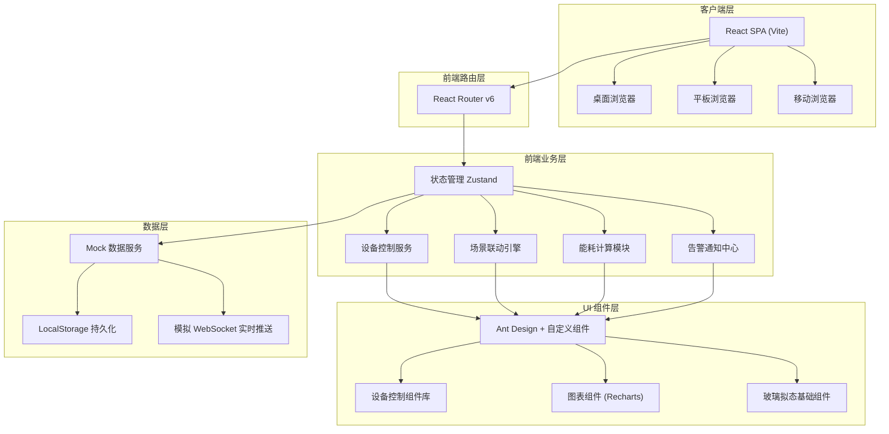
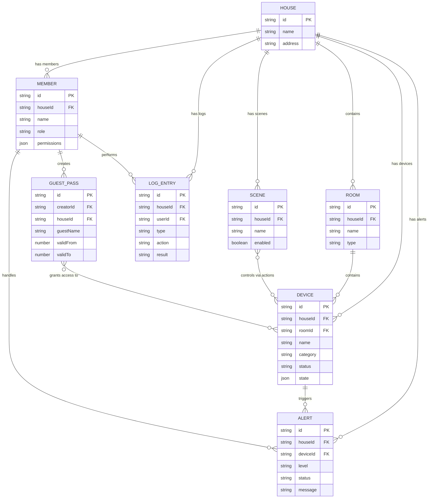

## 1. 架构设计



---

## 2. 技术选型说明

| 分类 | 技术栈 | 版本 | 选型理由 |
|------|--------|------|----------|
| 前端框架 | React | 18.2 | 生态成熟，组件化开发，适合复杂交互界面 |
| 构建工具 | Vite | 5.x | 极速热更新，开发体验优秀 |
| 语言 | TypeScript | 5.x | 类型安全，减少运行时错误 |
| 路由 | React Router | 6.x | 声明式路由，支持嵌套和懒加载 |
| 状态管理 | Zustand | 4.x | 轻量无 Provider 模式，API 简洁直观 |
| UI 基础库 | Ant Design | 5.x | 企业级组件库，覆盖大部分业务组件 |
| 图表库 | Recharts | 2.x | React 原生图表库，支持复杂交互与动画 |
| 样式方案 | TailwindCSS | 3.x | 原子化 CSS，快速构建玻璃拟态视觉 |
| 图标库 | Lucide React | 最新 | 精美线性图标，统一风格 |
| 日期处理 | dayjs | 最新 | 轻量日期库，兼容 Moment API |
| 拖拽交互 | @dnd-kit/core | 最新 | 场景编辑器动作拖拽排序 |
| 后端 | 无（纯前端 Mock） | - | 用户无后端需求，使用 Mock 数据模拟 |

---

## 3. 路由定义

| 路由路径 | 页面组件 | 页面名称 | 说明 |
|---------|---------|---------|------|
| `/` | 重定向到 `/dashboard` | - | 默认跳转首页 |
| `/dashboard` | `DashboardPage` | 首页总览 | 全屋状态、快捷场景、常用设备、能耗速览 |
| `/rooms` | `RoomsPage` | 房间页 | 按房间分组展示设备与环境数据 |
| `/rooms/:roomId` | `RoomDetailPage` | 房间详情 | 单个房间内设备批量操作与详情控制 |
| `/devices` | `DevicesPage` | 设备页 | 设备列表、筛选、配对、批量操作 |
| `/devices/:deviceId` | `DeviceDetailPage` | 设备详情 | 单个设备完整控制界面（滑入式面板） |
| `/scenes` | `ScenesPage` | 场景页 | 场景列表、触发执行 |
| `/scenes/editor` | `SceneEditorPage` | 场景编排 | 创建/编辑场景，可视化编排触发与动作 |
| `/energy` | `EnergyPage` | 能耗页 | 能耗统计、趋势图表、排行、建议 |
| `/alerts` | `AlertsPage` | 告警页 | 告警列表、处理操作、筛选检索 |
| `/members` | `MembersPage` | 成员页 | 家庭成员管理、授权、访客临时权限 |
| `/logs` | `LogsPage` | 日志页 | 操作日志、设备事件、追溯审计 |

---

## 4. 目录结构

```
src/
├── assets/                  # 静态资源
│   ├── images/              # 占位图、房屋/房间示意
│   └── fonts/               # 本地字体文件
├── components/              # 通用组件
│   ├── layout/              # 布局组件
│   │   ├── Sidebar.tsx      # 左侧导航栏
│   │   ├── Topbar.tsx       # 顶部状态栏（房屋切换、告警提示、用户信息）
│   │   └── AppLayout.tsx    # 整体布局容器
│   ├── devices/             # 设备控制组件
│   │   ├── LightControl.tsx     # 灯光开关+亮度色温调节
│   │   ├── ACControl.tsx        # 空调模式+温度+风速控制
│   │   ├── CurtainControl.tsx   # 窗帘开合度滑块
│   │   ├── LockStatus.tsx       # 门锁状态查看与开锁
│   │   ├── CameraPreview.tsx    # 摄像头预览占位
│   │   ├── DeviceCard.tsx       # 通用设备卡片
│   │   └── DeviceToggle.tsx     # 设备开关（Toggle）
│   ├── scenes/              # 场景相关组件
│   │   ├── SceneCard.tsx
│   │   ├── SceneTriggerEditor.tsx
│   │   └── SceneActionEditor.tsx
│   ├── energy/              # 能耗图表组件
│   │   ├── EnergyGauge.tsx      # 环形能耗仪表
│   │   ├── TrendChart.tsx       # 趋势折线图
│   │   └── RankBar.tsx          # 能耗排行条形图
│   ├── alerts/              # 告警组件
│   │   ├── AlertBanner.tsx      # 告警横幅
│   │   └── AlertCard.tsx        # 告警卡片
│   ├── common/              # 基础公共组件
│   │   ├── GlassCard.tsx        # 玻璃拟态卡片容器
│   │   ├── GradientButton.tsx   # 渐变发光按钮
│   │   ├── StatBlock.tsx        # 统计数值方块
│   │   └── ColorTempSlider.tsx  # 色温渐变滑杆
│   └── ui/                  # 原子 UI 组件（shadcn 风格）
├── pages/                   # 页面组件
│   ├── DashboardPage.tsx
│   ├── RoomsPage.tsx
│   ├── DevicesPage.tsx
│   ├── ScenesPage.tsx
│   ├── SceneEditorPage.tsx
│   ├── EnergyPage.tsx
│   ├── AlertsPage.tsx
│   ├── MembersPage.tsx
│   └── LogsPage.tsx
├── store/                   # Zustand 状态管理
│   ├── useHouseStore.ts     # 房屋/房间状态
│   ├── useDeviceStore.ts    # 设备状态与控制
│   ├── useSceneStore.ts     # 场景与联动
│   ├── useEnergyStore.ts    # 能耗数据
│   ├── useAlertStore.ts     # 告警状态
│   ├── useMemberStore.ts    # 成员与权限
│   └── useLogStore.ts       # 日志数据
├── types/                   # TypeScript 类型定义
│   ├── device.ts
│   ├── scene.ts
│   ├── energy.ts
│   ├── alert.ts
│   ├── member.ts
│   └── log.ts
├── mock/                    # Mock 数据生成
│   ├── houses.ts            # 房屋/房间模拟数据
│   ├── devices.ts           # 设备模拟数据
│   ├── scenes.ts            # 场景模拟数据
│   ├── energy.ts            # 能耗统计模拟数据
│   ├── alerts.ts            # 告警模拟数据
│   ├── members.ts           # 成员模拟数据
│   └── logs.ts              # 日志模拟数据
├── utils/                   # 工具函数
│   ├── formatters.ts        # 数值/日期格式化
│   ├── colors.ts            # 颜色工具（色温转RGB等）
│   └── permissions.ts       # 权限校验工具
├── App.tsx                  # 根组件
├── main.tsx                 # 入口文件
├── index.css                # 全局样式 + Tailwind + 自定义 CSS 变量
└── router.tsx               # 路由配置
```

---

## 5. 核心数据模型（TypeScript 类型）

### 5.1 设备相关类型

```typescript
// 设备类型枚举
type DeviceCategory = 'light' | 'ac' | 'curtain' | 'lock' | 'camera' | 'sensor' | 'tv' | 'speaker';

// 设备在线状态
type DeviceStatus = 'online' | 'offline' | 'fault';

// 灯光设备状态
interface LightState {
  power: boolean;
  brightness: number;      // 0-100
  colorTemp: number;       // 2700K-6500K
  color?: string;          // RGB彩色灯
}

// 空调设备状态
type ACMode = 'cool' | 'heat' | 'auto' | 'dry' | 'fan';
interface ACState {
  power: boolean;
  mode: ACMode;
  temperature: number;     // 16-30
  fanSpeed: 1 | 2 | 3 | 4 | 'auto';
  swing: boolean;
}

// 窗帘设备状态
interface CurtainState {
  position: number;        // 0=全关, 100=全开
}

// 门锁设备状态
type LockState = 'locked' | 'unlocked' | 'alarm';
interface LockDeviceState {
  state: LockState;
  battery: number;         // 0-100
  lastUnlockUser?: string;
  lastUnlockTime?: number;
}

// 传感器数据
interface SensorReading {
  temperature?: number;
  humidity?: number;
  pm25?: number;
  co2?: number;
  illumination?: number;   // 照度 lux
}

// 通用设备
interface Device {
  id: string;
  name: string;
  category: DeviceCategory;
  roomId: string;
  houseId: string;
  status: DeviceStatus;
  state: LightState | ACState | CurtainState | LockDeviceState | SensorReading;
  icon: string;
  pairedAt: number;
  firmware?: string;
}
```

### 5.2 场景相关类型

```typescript
type SceneTriggerType = 'manual' | 'schedule' | 'location' | 'device' | 'timeRange';
type SceneActionType = 'setDeviceState' | 'runScene' | 'delay' | 'notify';

interface SceneTrigger {
  id: string;
  type: SceneTriggerType;
  config: {
    cronExpression?: string;      // 定时 cron
    location?: 'arrive' | 'leave'; // 位置触发
    deviceId?: string;            // 设备状态触发
    condition?: string;           // 条件表达式
  };
}

interface SceneAction {
  id: string;
  type: SceneActionType;
  order: number;
  delayMs?: number;
  target: {
    deviceId?: string;
    sceneId?: string;
  };
  state?: Partial<Device['state']>;
}

interface Scene {
  id: string;
  name: string;
  icon: string;
  color: string;
  houseId: string;
  enabled: boolean;
  triggers: SceneTrigger[];
  actions: SceneAction[];
  lastRunAt?: number;
  createdAt: number;
}
```

### 5.3 成员与权限类型

```typescript
type MemberRole = 'owner' | 'admin' | 'member' | 'guest' | 'property';
type PermissionKey =
  | 'device:control'
  | 'device:pair'
  | 'scene:execute'
  | 'scene:edit'
  | 'energy:view'
  | 'alert:handle'
  | 'member:invite'
  | 'member:authorize'
  | 'log:view'
  | 'lock:unlock'
  | 'camera:view';

interface Member {
  id: string;
  name: string;
  avatar: string;
  phone: string;
  role: MemberRole;
  houseId: string;
  permissions: PermissionKey[];
  isOnline: boolean;
  lastActiveAt: number;
  createdAt: number;
}

interface GuestPass {
  id: string;
  guestName: string;
  guestPhone?: string;
  creatorId: string;
  houseId: string;
  validFrom: number;
  validTo: number;
  permissions: PermissionKey[];
  deviceIds: string[];       // 可访问设备
  code: string;              // 临时凭证
  usedCount: number;
  maxUseCount?: number;
  revoked: boolean;
  createdAt: number;
}
```

### 5.4 告警与日志类型

```typescript
type AlertLevel = 'critical' | 'warning' | 'info';
type AlertStatus = 'pending' | 'handling' | 'resolved' | 'ignored';

interface Alert {
  id: string;
  level: AlertLevel;
  title: string;
  message: string;
  houseId: string;
  deviceId?: string;
  roomId?: string;
  status: AlertStatus;
  handlerId?: string;
  handledAt?: number;
  createdAt: number;
  snapshot?: Record<string, unknown>;
}

type LogType = 'operation' | 'device' | 'alert' | 'member' | 'scene';

interface LogEntry {
  id: string;
  type: LogType;
  timestamp: number;
  houseId: string;
  userId?: string;
  userName?: string;
  action: string;
  targetType?: string;
  targetId?: string;
  targetName?: string;
  result: 'success' | 'failed';
  detail?: string;
  ip?: string;
  userAgent?: string;
}
```

---

## 6. 数据模型 ER 关系图



---

## 7. 全局状态管理架构（Zustand Store）

```typescript
// useAppStore.ts - 全局聚合状态
interface AppStore {
  currentHouseId: string;
  currentUserId: string;
  theme: 'dark';
  sidebarCollapsed: boolean;
  // Actions
  setCurrentHouse: (id: string) => void;
  toggleSidebar: () => void;
}

// useDeviceStore.ts - 设备状态与控制
interface DeviceStore {
  devices: Device[];
  selectedDeviceIds: string[];
  loading: boolean;
  // Actions
  fetchDevices: (houseId: string) => Promise<void>;
  toggleDevice: (id: string) => void;
  updateDeviceState: (id: string, patch: Partial<Device['state']>) => void;
  batchToggle: (ids: string[], power: boolean) => void;
  pairDevice: (data: Omit<Device, 'id'>) => void;
  toggleSelect: (id: string) => void;
  clearSelection: () => void;
}
```

---

## 8. 性能与体验保障

1. **组件懒加载**：所有 page 级组件通过 `React.lazy` + `Suspense` 按需加载
2. **虚拟滚动**：设备列表、日志列表超过 100 条时启用虚拟滚动
3. **防抖节流**：滑杆调节 80ms 节流，搜索输入 300ms 防抖
4. **乐观更新**：设备控制立即更新 UI，后台模拟异步请求，失败则回滚
5. **动画性能**：所有动效使用 `transform` / `opacity`，避免触发重排重绘
6. **CSS 变量主题**：所有颜色、间距、阴影使用 CSS 变量，便于统一维护
