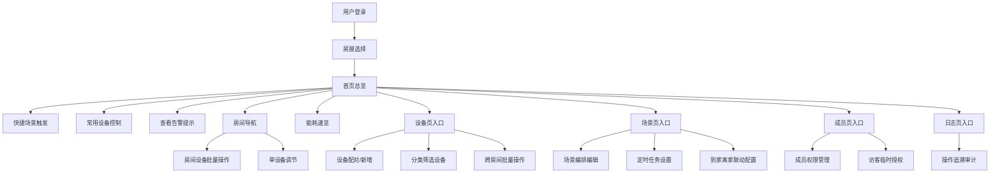

## 1. 产品概述

智能家居控制中枢是一款面向家庭住户与物业管家的统一管理平台，集中控制多房间智能设备与日常场景联动。通过直观的可视化界面，让用户轻松实现设备管理、能耗监控、安全防护和成员授权，构建高效、便捷、安全的智慧生活体验。

- 目标用户：家庭住户（户主、成员、访客）、物业管家
- 核心价值：统一入口管理全屋智能设备，降低操作复杂度，提升居住品质与安全性

---

## 2. 核心功能

### 2.1 用户角色

| 角色 | 说明 | 核心权限 |
|------|------|----------|
| 户主/管理员 | 房屋产权人或最高权限用户 | 全部权限：设备管理、场景编排、成员授权、系统配置 |
| 家庭成员 | 户主授权的家人 | 设备控制、场景触发、查看日志、能耗浏览 |
| 访客 | 临时到访人员（限时） | 门锁临时开锁、指定区域设备使用 |
| 物业管家 | 小区物业管理人员 | 告警接收与处理、远程协助、设备报修 |

### 2.2 功能模块总览

1. **首页总览**：全屋状态概览、快捷场景面板、实时告警提示、能耗速览、常用设备
2. **房间页**：按房间分组展示设备、房间内批量操作、房间环境数据
3. **设备页**：设备列表与筛选、设备详情控制、批量开关、设备配对管理
4. **场景页**：场景编排、定时任务、到家/离家联动、一键触发
5. **能耗页**：实时能耗、分类统计、趋势图表、能耗排行、节能建议
6. **告警页**：异常告警列表、告警详情、告警处理、历史告警
7. **成员页**：家庭成员管理、分级授权、访客临时权限
8. **日志页**：操作日志追溯、设备事件、告警历史、筛选检索

### 2.3 页面详情

| 页面名称 | 模块名称 | 功能描述 |
|---------|---------|---------|
| 首页总览 | 房屋切换栏 | 多房屋下拉切换、当前房屋信息展示 |
| 首页总览 | 快捷场景面板 | 常用场景卡片（回家、离家、睡眠、影院等），一键触发 |
| 首页总览 | 全屋状态概览 | 设备在线数/总数、开启设备数、安防状态、门锁状态 |
| 首页总览 | 常用设备快捷 | 灯光、空调、窗帘等常用设备快速控制开关与调节 |
| 首页总览 | 实时告警提示 | 最近告警横幅展示，点击跳转告警页 |
| 首页总览 | 今日能耗速览 | 今日用电量、同比变化、主要用电设备 |
| 房间页 | 房间分组导航 | 客厅、主卧、次卧、厨房、卫生间、阳台等房间Tab切换 |
| 房间页 | 房间环境卡片 | 温度、湿度、PM2.5、光照等环境数据展示 |
| 房间页 | 房间设备列表 | 房间内所有设备卡片，支持逐个控制 |
| 房间页 | 批量操作栏 | 房间内设备全关/全开、按类型批量控制 |
| 房间页 | 场景推荐 | 该房间常用场景推荐 |
| 设备页 | 设备分类筛选 | 按类型筛选：灯光、空调、窗帘、门锁、摄像头、传感器 |
| 设备页 | 设备配对入口 | 新增设备搜索、蓝牙/WiFi配对向导 |
| 设备页 | 设备卡片列表 | 设备状态展示、快捷开关、在线状态指示 |
| 设备页 | 设备详情面板 | 亮度色温滑杆、空调模式/温度/风速、窗帘开合度、门锁状态查看、摄像头预览 |
| 设备页 | 批量操作面板 | 跨房间设备选择、批量开关、批量参数设置 |
| 场景页 | 我的场景列表 | 已创建场景卡片，展示触发方式与关联设备 |
| 场景页 | 场景编辑器 | 可视化编排：触发条件（定时/设备状态/位置）+ 执行动作（多设备联动） |
| 场景页 | 定时任务管理 | 定时/循环场景设置，日历视图展示 |
| 场景页 | 到家离家联动 | 基于手机位置的自动场景触发（到家模式、离家模式） |
| 场景页 | 场景一键执行 | 卡片点击立即执行场景 |
| 能耗页 | 实时能耗仪表 | 当前功率、今日/本周/本月用电量环形仪表 |
| 能耗页 | 能耗趋势图 | 日/周/月/年折线/柱状图切换 |
| 能耗页 | 分类能耗统计 | 按设备类型、按房间分类统计饼图/条形图 |
| 能耗页 | 能耗排行 | 设备能耗TOP10排行 |
| 能耗页 | 节能建议 | 智能分析生成节能小贴士 |
| 告警页 | 告警概览卡片 | 未处理告警数、各级别告警统计 |
| 告警页 | 告警列表 | 告警级别（紧急/警告/提示）图标、时间、设备、消息 |
| 告警页 | 告警处理操作 | 查看详情、标记已读、忽略、联系物业、一键处理 |
| 告警页 | 告警筛选 | 按时间、级别、设备类型筛选 |
| 成员页 | 家庭成员列表 | 头像、姓名、角色、权限级别、在线状态 |
| 成员页 | 成员邀请/编辑 | 手机号邀请、角色分配、权限勾选 |
| 成员页 | 访客临时权限 | 创建临时密钥、有效期设置、权限范围（门锁/指定设备） |
| 成员页 | 权限分级矩阵 | 各角色功能权限矩阵展示与配置 |
| 日志页 | 操作日志列表 | 时间、用户、操作类型、操作对象、操作结果 |
| 日志页 | 设备事件日志 | 设备状态变更、在线离线、告警触发记录 |
| 日志页 | 高级筛选 | 按用户、设备、时间范围、操作类型检索 |
| 日志页 | 日志详情 | 完整操作上下文、IP、设备信息 |

---

## 3. 核心流程

### 3.1 主要用户流程

**日常设备控制流程**：
用户进入首页 → 查看全屋状态 → 通过快捷面板或进入房间页/设备页 → 选择设备 → 调节参数（亮度/温度/开合度）→ 操作生效并反馈状态变化

**场景编排流程**：
用户进入场景页 → 点击创建场景 → 命名并选择图标 → 添加触发条件（定时/手动/位置）→ 添加执行动作（设备1开+设备2调温+设备3关帘）→ 保存并启用

**访客授权流程**：
户主进入成员页 → 创建访客权限 → 填写访客姓名/手机号 → 设置有效期（起止时间）→ 勾选可用设备（门锁+客厅灯）→ 生成临时凭证 → 分享给访客

**告警处理流程**：
系统检测异常（如烟雾报警/门锁异常）→ 首页告警横幅推送 + 声音提醒 → 用户点击查看 → 浏览详情 → 一键处理/联系物业 → 标记已处理 → 记录到日志

### 3.2 核心流程图

---

## 4. 用户界面设计

### 4.1 设计风格

**美学方向**：深色系科技感 + 柔和渐变玻璃拟态（Glassmorphism）

- **主色调**：深空蓝 `#0B1220` 作为背景基底，搭配科技蓝 `#3B82F6` 与青碧色 `#06B6D4` 渐变作为主品牌色
- **辅助色**：能源金 `#F59E0B`（能耗/温度）、安全绿 `#10B981`（正常/门锁）、警示橙 `#F97316`（警告）、警报红 `#EF4444`（紧急告警）
- **按钮风格**：圆角 14px，主要按钮使用蓝青渐变填充 + 微发光效果，次要按钮半透明玻璃态
- **字体方案**：展示字体使用 `Orbitron`（科技感数字显示），正文字体使用 `Manrope`（现代无衬线），确保层次分明
- **布局风格**：左侧固定导航栏 + 顶部状态栏 + 主内容卡片网格，毛玻璃卡片 + 浮动投影营造空间层次感
- **图标风格**：统一使用线性+填充双模式图标，激活态带彩色发光描边

### 4.2 页面设计概览

| 页面名称 | 模块名称 | UI 元素设计 |
|---------|---------|------------|
| 首页总览 | 全屋状态概览 | 半透明圆角卡片，4 个数据模块带发光数字显示，状态点闪烁动画 |
| 首页总览 | 快捷场景面板 | 4 列场景卡片网格，点击有波纹扩散动画，激活态有发光边框 |
| 首页总览 | 常用设备快捷 | 设备卡片带滑动开关（Toggle），点击展开调节滑块（亮度/色温/温度） |
| 首页总览 | 今日能耗速览 | 环形渐变进度图，中心显示用电量数字，底部同比箭头 |
| 房间页 | 房间环境卡片 | 大圆角卡片，环境数据以图标+大号数字呈现，背景微渐变色 |
| 房间页 | 批量操作栏 | 吸顶横向工具栏，玻璃态背景，按钮带悬浮上浮效果 |
| 设备页 | 设备详情面板 | 右侧滑入式面板（Drawer），调节控件带实时反馈动效 |
| 设备页 | 亮度色温调节 | 横向渐变滑杆（冷白→暖白），滑块带光晕预览 |
| 设备页 | 空调控制 | 圆形转盘选温器，模式切换标签带图标动画 |
| 场景页 | 场景编辑器 | 左侧触发条件 + 右侧执行动作双栏布局，动作卡片可拖拽排序 |
| 能耗页 | 能耗趋势图 | SVG 折线/柱状图，支持鼠标悬停显示详情，数据点高亮动画 |
| 能耗页 | 能耗排行 | 横向条形图排行，TOP3 带金银铜渐变色标识 |
| 告警页 | 告警列表 | 卡片左边缘按级别显示不同彩色竖条，紧急告警带脉冲动画 |
| 成员页 | 成员列表 | 头像+玻璃态卡片，权限级别用彩色标签区分 |
| 日志页 | 日志列表 | 时间轴样式布局，每条日志带操作类型图标与颜色标识 |

### 4.3 响应式设计

- **Desktop 优先**：主设计断点 1440px，左侧导航固定 260px 宽度
- **平板适配**：断点 1024px，左侧导航折叠为 72px 图标栏
- **移动端适配**：断点 768px，顶部汉堡菜单抽屉式导航，卡片改为单列布局，控件触摸区域 ≥ 44px
- **全局适配**：所有滑块、开关、按钮均增加触摸热区；横屏模式自动调整卡片网格列数

### 4.4 动效与交互细节

- 页面切换：淡入 + 向上位移 12px，stagger 100ms 依次呈现卡片
- 设备开关：Toggle 300ms 缓动 + 背景色渐变过渡，关闭时发光渐隐
- 场景触发：点击瞬间波纹扩散 → 场景卡片边框发光呼吸 2 秒
- 告警推送：从右侧滑入横幅 + 轻微震动感（translate 抖动动画）
- 数字变化：能耗/温度数据变化时使用数字滚动动画（count-up）
